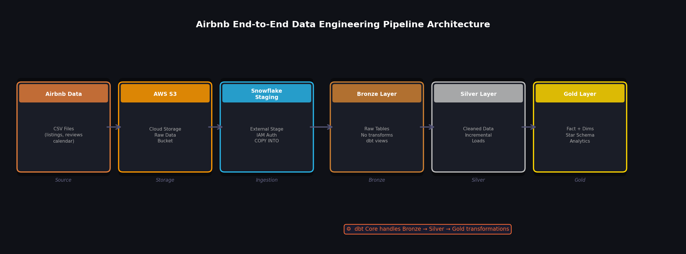

# Airbnb End-to-End Data Engineering Pipeline
### Built with dbt | Snowflake | AWS S3



---

## Project Overview

An end-to-end data engineering pipeline built on real-world **Airbnb dataset**, implementing industry-standard practices including **Medallion Architecture**, **incremental data loading**, **SCD Type 2**, and **metadata-driven transformations**.

**Data flows from:** Raw CSV files → AWS S3 → Snowflake → Bronze → Silver → Gold (analytics-ready)

---

## Tech Stack

| Tool | Purpose |
|---|---|
| **AWS S3** | Cloud storage for raw source data |
| **Snowflake** | Cloud data warehouse |
| **dbt Core** | Data modeling, transformation & testing |
| **Python 3.12** | Environment & tooling |
| **Git** | Version control |

---

## Architecture

```
Source Data (CSV)
      │
      ▼
   AWS S3
      │
      ▼
Snowflake Staging
      │
      ▼
┌─────────────────────────────────────┐
│          MEDALLION ARCHITECTURE     │
│                                     │
│  Bronze Layer  →  Silver Layer  →  Gold Layer  │
│  (Raw)            (Cleaned)        (Analytics) │
└─────────────────────────────────────┘
```

---

## Project Structure

```
airbnb-de-project/
├── models/
│   ├── staging/          # Bronze: Raw data ingestion from Snowflake stages
│   │   ├── stg_listings.sql
│   │   ├── stg_reviews.sql
│   │   ├── stg_calendar.sql
│   │   └── schema.yml
│   ├── silver/           # Silver: Cleaned & enriched data
│   │   ├── silver_listings.sql
│   │   ├── silver_reviews.sql
│   │   └── schema.yml
│   └── marts/            # Gold: Star schema — Fact & Dimension tables
│       ├── fact_bookings.sql
│       ├── dim_listings.sql
│       ├── dim_hosts.sql
│       ├── dim_dates.sql
│       └── schema.yml
├── snapshots/
│   └── scd_listings.sql  # SCD Type 2 for listings history
├── macros/
│   └── incremental_filter.sql
├── tests/
│   └── assert_positive_price.sql
├── setup/
│   ├── snowflake_setup.sql
│   └── aws_s3_setup.md
├── assets/               # Architecture diagrams
├── dbt_project.yml
├── packages.yml
└── .gitignore
```

---

## Key Concepts Implemented

- **Medallion Architecture** — Bronze / Silver / Gold layered pipeline
- **Incremental Loading** — Only processes new or changed records
- **Metadata-Driven Pipelines** — Dynamic joins via YAML config, no hardcoded SQL
- **SCD Type 2** — Tracks historical changes in listings using dbt Snapshots
- **Star Schema** — Fact + Dimension tables optimized for analytics
- **Jinja Templating** — Reusable macros across dbt models
- **Data Quality Tests** — Both generic (not_null, unique) and singular tests

---

## Setup Instructions

### Prerequisites
- Python 3.12+
- AWS Account (free tier)
- Snowflake Account (free trial — $400 credits)
- dbt Core installed

### Step 1 — Install dbt
```bash
pip install dbt-core dbt-snowflake
```

### Step 2 — Configure Snowflake
Run the setup script in your Snowflake worksheet:
```sql
-- See setup/snowflake_setup.sql
```

### Step 3 — Configure AWS S3
Follow the guide in `setup/aws_s3_setup.md` to:
- Create an S3 bucket
- Upload Airbnb CSV files
- Configure IAM roles for Snowflake integration

### Step 4 — Configure dbt Profile
Create `~/.dbt/profiles.yml`:
```yaml
airbnb_project:
  target: dev
  outputs:
    dev:
      type: snowflake
      account: <your_account>
      user: <your_user>
      password: <your_password>
      role: TRANSFORM
      database: AIRBNB
      warehouse: COMPUTE_WH
      schema: DEV
      threads: 4
```

### Step 5 — Run the Pipeline
```bash
dbt deps          # Install packages
dbt seed          # Load seed data
dbt run           # Run all models
dbt test          # Run data quality tests
dbt snapshot      # Run SCD Type 2 snapshots
dbt docs generate # Generate documentation
dbt docs serve    # View lineage graph
```

---

## Data Source

Public data from [Inside Airbnb](http://insideairbnb.com/get-the-data/)

| File | Description |
|---|---|
| `listings.csv` | Listing metadata (host, price, location, room type) |
| `calendar.csv` | Daily availability and pricing per listing |
| `reviews.csv` | Guest reviews with dates |

---

## dbt Model Lineage

```
stg_listings ──┐
stg_reviews  ──┤──► silver_listings ──┐
stg_calendar ──┘    silver_reviews  ──┤──► fact_bookings
                                       ├──► dim_listings
                                       ├──► dim_hosts
                                       └──► dim_dates
```

---

## Data Quality Tests

- Listings must have a positive price
- No null values on primary keys
- Unique constraint on listing_id, review_id
- Review dates must be valid

---

## Author

**Mudasir** | 

